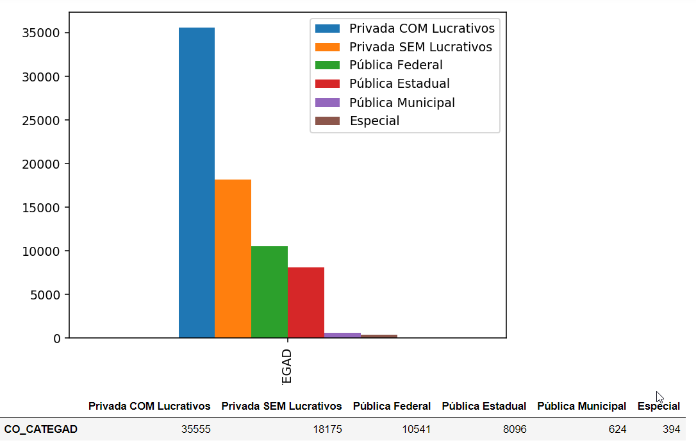
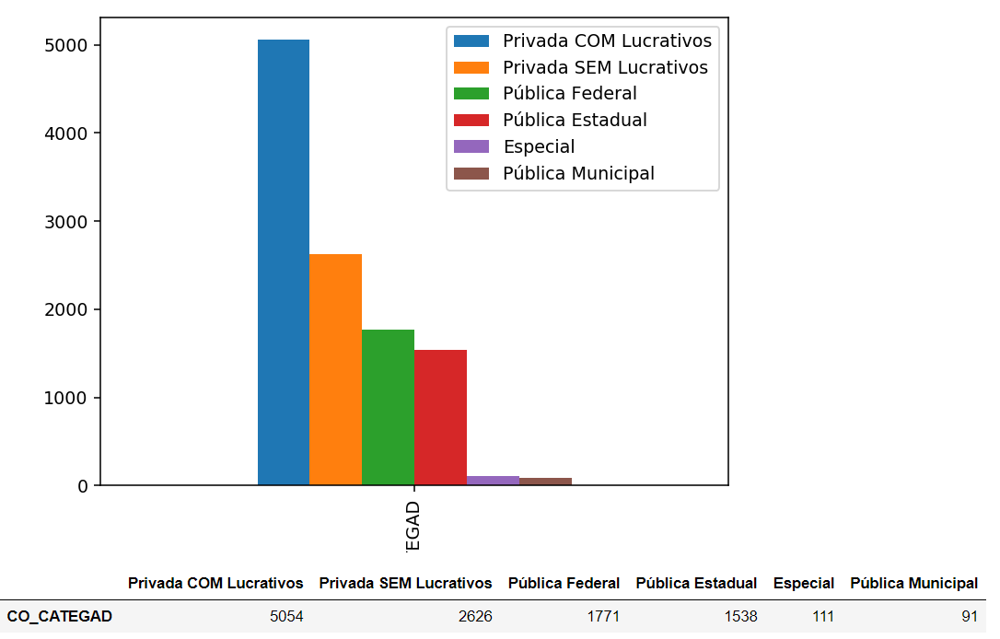

# Licenciatura x Tipo de Instituição
Baseado por tipo de Instituição, o levantamento mostrará resultados apenas para os participantes do ENADE 2017 que cursam algum curso de Licenciatura.

# Links de Acesso as Bases
Bases utilizadas para o estudo:

[Microdados ENADE 2017](http://download.inep.gov.br/microdados/Enade_Microdados/microdados_Enade_2017_portal_2018.10.09.zip)

  
# Recomendações para o uso:
  1 - Instale as bibliotecas colocadas no arquivo requirements.txt (pip install -r requirements.txt)

  2 - Baixe as bases de dados especificadas acima.

  3 - Salve as bases recem baixadas num diretorio BASES/DADOS/ na mesma pasta que o arquivo .ipynb

  4 - Execute jupyter notebook no seu CMD e navegue pela arvore até encontrar o Estudos.ipynb

  5 - Use nosso notebook sem moderação! :)

# Resultados Colhidos

## Vocação

    
    

## Não pretende dar aulas

    
    

